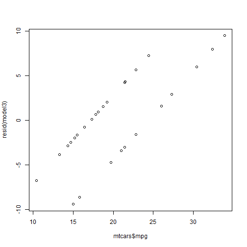
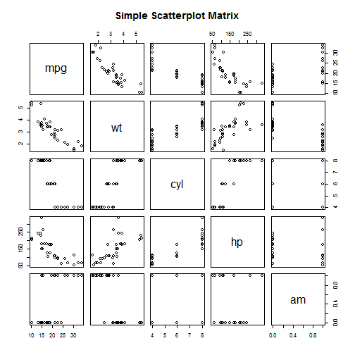

Effect of transmission type on mileage
===========================================================================
Executive Summary
The objective of this study is to see if the type of transmission affects the mileage of
a car. Motor Trends dataset mtcars is used for this study. A linear regression analysis is performed to see if cars with automatic transmission have better mileage than cars with manual transmission. The conclusions from the analysis is that weight is a stronger predictor of mileage as opposed to transmission.

Analysis
========

```r
data(mtcars)
```

It can be seen there are other variables in the mtcars dataset that might influence the 
mileage of cars in some way. First will start looking at the trends in data by each pairs
of variables to see if any of them show a strong trend with respect to mileage.
There are 32 observations in the data of which 19 are manual transmission and 13 are 
automatic transmission. Weight shows a strong negative trend on mileage as weight increases miles per gallon decreases. As horsepower increases mpg decreases. Following are the steps that will be followed to decide if transmission type affects the mileage in any way.
Regression steps
================

```r
model1 <- lm(mpg ~ ., data = mtcars)
mtcars$am.f <- factor(mtcars$am)
model2 <- lm(mpg ~ wt + I(am.f), data = mtcars)
model3 <- lm(mpg ~ I(am.f), data = mtcars)
plot(mtcars$mpg, resid(model3))
```

 

```r
Comp23 <- anova(model2, model3)
```

Interpretation
===============
Among all the variables only the coefficient for weight shows a significance at 90% CI.
Will consider a model with mpg as predicted variable and using weight and automatic
transmissions as independent variables. In model 3 automatic transmission shows a coefficient that has a p-value of <0.005. However plotting the residuals against predicted variables shows an upward trend. Hence model 3 is rejected. Further comparing models 2 & 3 it can be concluded that weight is a better indicator of mileage. The coefficient for automatic transmission in model two is -0.02 with p-value at 0.988.
Conclusion
==========================================================
Type of transmission does not influence mileage in a significant manner.

                        Appendix
==========================================================
Analyze data
=============

```r
pairs(~mpg + wt + cyl + hp + am, data = mtcars, main = "Simple Scatterplot Matrix")
```

 

```r
Comp23
```

```
## Analysis of Variance Table
## 
## Model 1: mpg ~ wt + I(am.f)
## Model 2: mpg ~ I(am.f)
##   Res.Df RSS Df Sum of Sq    F  Pr(>F)    
## 1     29 278                              
## 2     30 721 -1      -443 46.1 1.9e-07 ***
## ---
## Signif. codes:  0 '***' 0.001 '**' 0.01 '*' 0.05 '.' 0.1 ' ' 1
```

```r
model2$coef
```

```
## (Intercept)          wt    I(am.f)1 
##    37.32155    -5.35281    -0.02362
```

```r
model3$coef
```

```
## (Intercept)    I(am.f)1 
##      17.147       7.245
```


